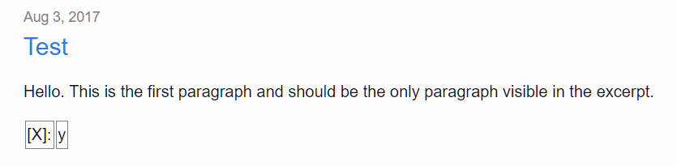

# table-excerpt-repro
This repo reporduces a bug with Jekyll's Markdown parsing. Specifically, suppose something resembling the following code snippet is in your post:

```
[X]:|y
```

Then Jekyll will display that line of your snippet as a table inside the post excerpt.

For example, [this post](/_posts/2017-08-03-test.markdown) generates the following excerpt:



This repo uses the instructions from the [quick-start guide](https://jekyllrb.com/docs/quickstart/).
The only change was to modify the `home.html` layout to include `{{ post.excerpt }}` and to add a 
bit of CSS to the document head to make the table edges visible.
